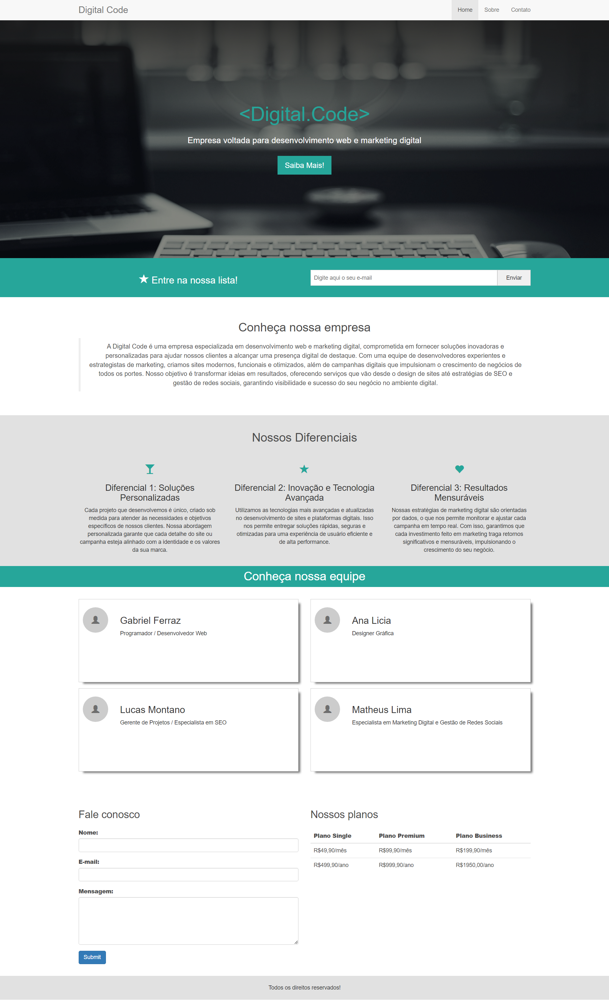
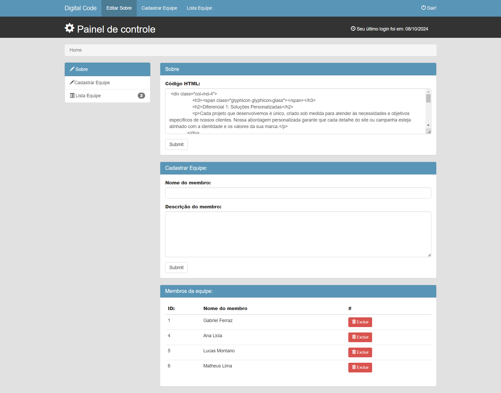

# Digital Code - Bootstrap Site

<h3>Descrição do Projeto</h3>

O DigitalCode é um site de uma empresa fictícia de desenvolvimento web e marketing digital, criado utilizando HTML5, CSS3, PHP, JavaScript e Bootstrap. O site é totalmente responsivo e possui um design moderno para exibir informações sobre os serviços oferecidos pela empresa. Além disso, conta com um painel de controle próprio para realizar todas as alterações do site de maneira prática e rápida, com todas as informações sendo atualizadas diretamente no banco de dados.

<h3>Funcionalidades principais:</h3>
<li>Página inicial responsiva com informações sobre a empresa e serviços.</li>
 
<li>Formulário de contato funcional para envio de mensagens.</li>
 
<li>Painel de Controle que permite ao administrador gerenciar todo o conteúdo do site, como serviços, equipe, preços e informações institucionais.</li>
 
<li>Banco de Dados MySQL onde todas as alterações feitas pelo painel são refletidas em tempo real.</li>
 
<li>Layout responsivo utilizando Bootstrap para garantir a acessibilidade em dispositivos móveis, tablets e desktops.</li>
 
<h3>Tecnologias Utilizadas</h3>
<li>HTML5: estrutura das páginas.</li>
 
<li>CSS3: estilização das páginas.</li>
 
<li>JavaScript: funcionalidades dinâmicas do site.</li>
 
<li>Bootstrap: framework front-end para responsividade.</li>
 
<li>PHP: gerenciamento das funções de back-end.</li>
 
<li>MySQL: banco de dados para armazenar e gerenciar as informações atualizadas pelo painel de controle.</li>
 
<h3>Como executar o projeto localmente</h3>

1- Clone este repositório:

git clone https://github.com/devgabrielferraz/digitalcode-bootstrap-site.git

2- Instale um servidor local como o XAMPP ou WAMP para rodar o PHP.

3- Implemente o banco de dados:

<li>Crie um banco de dados no MySQL com as tabelas correspondentes às funcionalidades do painel de controle.</li>
 
<li>Importe o arquivo SQL que está incluído neste repositório (se houver) para configurar as tabelas.</li>
 

4- Inicie o servidor local e acesse o site no navegador pelo endereço:

http://localhost/digitalcode-bootstrap-site/

5- Acesse o painel de controle:

O painel de controle pode ser acessado por meio da URL: http://localhost/digitalcode-bootstrap-site/admin/

Se não der certo pela URL acima tente acessar o painel de controle através da URL abaixo:

http://localhost/digitalcode-bootstrap-site/bootstrap_admin_2

6- Faça as alterações no site diretamente pelo painel, e veja as mudanças refletirem-se no banco de dados em tempo real.

<h3>Observação</h3>

Certifique-se de incluir o arquivo SQL do banco de dados no localhost/phpmyadmin, a importação do arquivo SQL é necessário para que outros usuários possam testar o site e o painel de controle.

 
 

Imagem do site:

 

Imagem do Painel de Controle:

 
